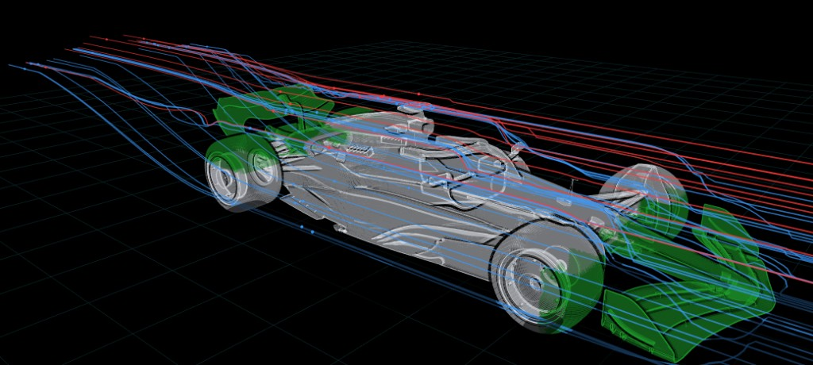
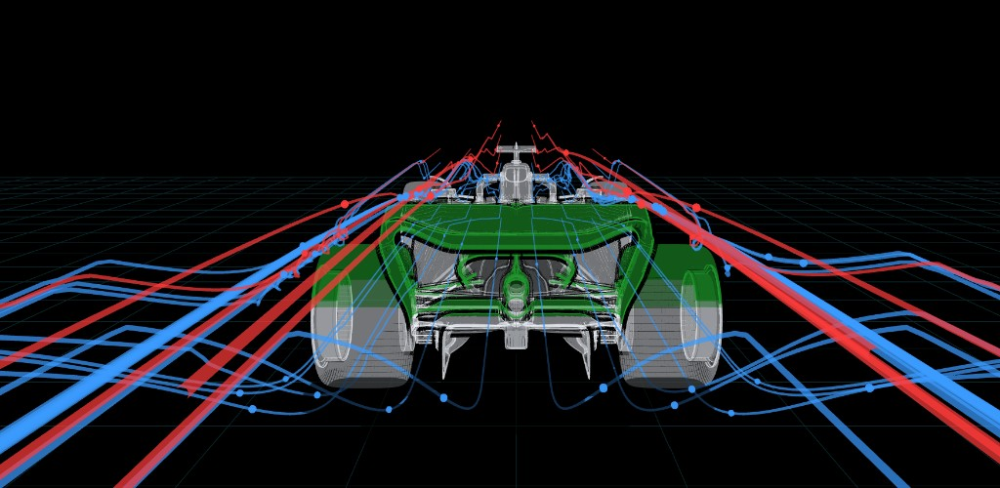

# F1 Aero Flow — RB19 Streamline Visualizer

An interactive 3D aerodynamics visualizer for a Formula 1 car (RB19 model). It renders
the car as a translucent neon shell and traces wind streamlines over, around, and under
the body using a lightweight potential-flow model (freestream + horseshoe-vortex +
source-panel solve for the rear wing, with voxel-based body deflection for the rest).

**Live demo:** https://aero-visual.vercel.app

## Screenshots

| 3/4 view — streamlines over the body | Rear view — underbody & wake flow |
| --- | --- |
|  |  |

## Features

- Real-time streamlines that hug the bodywork and glide along the ground.
- Structural part menu — isolate the front wing, nose, sidepods, floor, or rear wing
  and see each part's solid shell plus its own wind interaction.
- Rear wing driven by an ML-trained section-Cl model feeding a horseshoe/panel solve;
  other parts use freestream deflected around their voxelized solids.
- Neon-green highlighting on the key aero surfaces (front & rear wings), black
  silhouette outlining, and soft cast shadows.
- Camera presets (3/4, side, front, top, rear), wind-speed and line-thickness controls.
- Mobile-friendly: responsive HUD, one-finger orbit, two-finger pinch zoom, and reduced
  GPU load on phones.

## Running locally

The app loads `rb19.glb` via `fetch`, so it must be served over HTTP (not opened as a
`file://` URL):

```bash
python -m http.server 8765
# then open http://127.0.0.1:8765/index.html
```

## Project layout

| Path | Description |
| --- | --- |
| `index.html` | The entire app (Three.js scene, physics, UI). |
| `rb19.glb` | The 3D car model loaded at runtime (Draco-compressed, ~2.5 MB). |
| `screenshots/` | Preview images used in this README. |
| `rb19.zip` | Original packaged model source. |
| `_model_extract.json` | Extracted model metadata. |
| `model.txt` | Primitive F1 starter/reference geometry notes. |
| `export_rb19.py`, `assemble_aero.py` | Model export / aero assembly pipeline. |
| `fix_*.py`, `patch_*.py` | Iterative patches used while building the visualizer. |
| `probe.html`, `smoke_flow.html`, `debug_flow.js` | Dev / debugging harnesses. |

## Tech

- [Three.js](https://threejs.org/) r128 + GLTFLoader / DRACOLoader (via CDN)
- Vanilla JS, no build step
- Deployed as a static site on Vercel

## Deploy

```bash
# static deploy of the site + model
vercel deploy ./dist --prod
```
