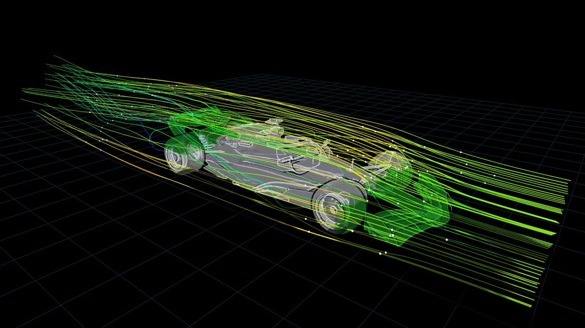
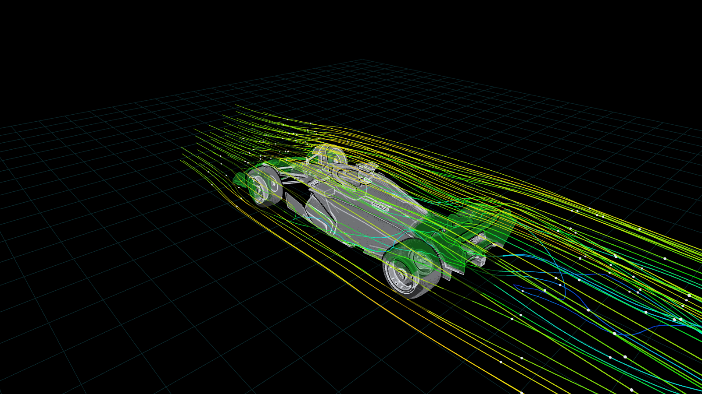
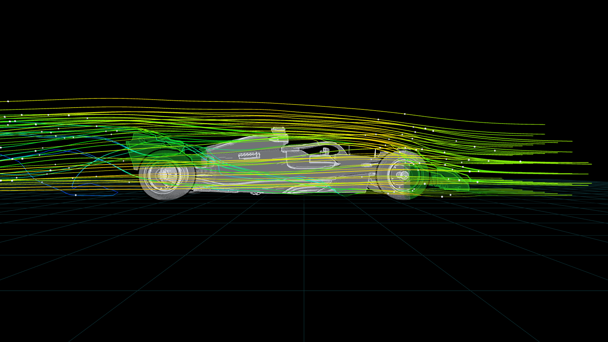
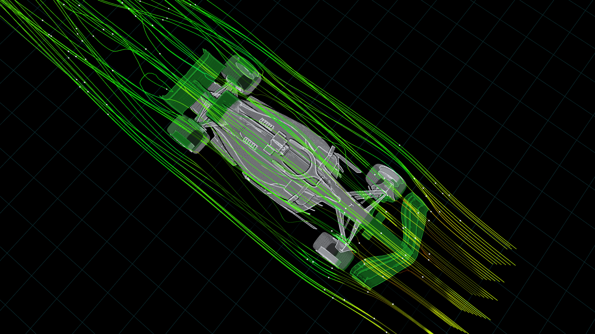
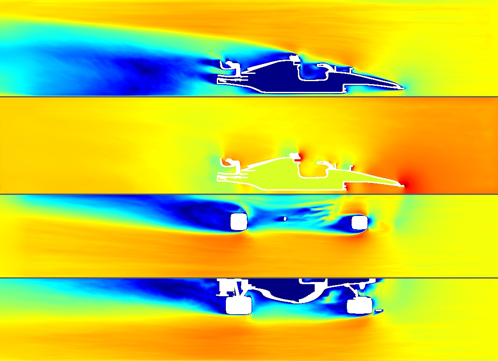

# F1 Aero Flow — RB19 Streamline Visualizer

An interactive 3D aerodynamics visualizer for a Formula 1 car (RB19 model). It renders
the car as a translucent neon shell and traces wind streamlines over, around, and under
the body through a **real CFD flow field**. The field is computed offline by a custom
CUDA lattice Boltzmann wind-tunnel solver (LES turbulence model, rolling road, 50M cells)
and shipped with the site. See [`cuda/README.md`](cuda/README.md).

**Live demo:** https://aero-visual.vercel.app

## Screenshots

Streamlines traced through the CUDA CFD solution, coloured by simulated air speed
(blue = slow, yellow/red = fast) or pressure.

| 3/4 view — flow over the body (speed) | Rear 3/4 — slow wake behind the car (speed) |
| --- | --- |
|  |  |
| **Side view — flow over and under the car (speed)** | **Top view — flow around the car (pressure)** |
|  |  |

**Raw CFD output** (1.25 cm grid, half car). From top to bottom: speed on the
centreline, pressure coefficient on the centreline (nose stagnation in red), speed 5 cm
above the road (fast air under the floor, wheel wakes), and speed 50 cm up:



## Features

- Streamlines traced through a time-averaged CFD solution from a hand-written CUDA
  D3Q19 lattice Boltzmann solver, coloured by simulated speed or pressure, with the
  simulation's own drag and lift coefficients shown on screen.
- Falls back to the original analytic model (ML section Cl + horseshoe vortex +
  source panels) if the flow file is unavailable.
- Structural part menu — isolate the front wing, nose, sidepods, floor, or rear wing
  and see each part's solid shell plus its own wind interaction.
- Rear wing driven by an ML-trained section-Cl model feeding a horseshoe/panel solve;
  other parts use freestream deflected around their voxelized solids.
- Neon-green highlighting on the key aero surfaces (front & rear wings), black
  silhouette outlining, and soft cast shadows.
- Camera presets (3/4, side, front, top, rear), wind-speed and line-thickness controls.
- Mobile-friendly: responsive HUD, one-finger orbit, two-finger pinch zoom, and reduced
  GPU load on phones.

## Machine learning · airfoil Cl/Cd model

The rear-wing aerodynamics are informed by a small ML model that predicts lift (`Cl`) and
drag (`Cd`) coefficients directly from airfoil shape. The full training notebook lives in
[`ml/airfoil_ml_project.ipynb`](ml/airfoil_ml_project.ipynb).

**Data.** A public OpenFOAM CFD dataset of 2,946 airfoils at Reynolds number 1e5. Each
airfoil is described by 8 [CST shape coefficients](https://en.wikipedia.org/wiki/Class_shape_transformation)
and sampled across ~11–13 angles of attack, giving `Cl` and `Cd` per (shape, AoA).

**Features → targets.** Inputs are `AoA` + the 8 CST coefficients (9 features); outputs are
`[Cl, Cd]`.

**Leakage-safe split.** Because each airfoil appears in many rows (one per AoA), a naive
row-level split would leak the same shape into both train and validation. The notebook uses
`GroupShuffleSplit` keyed on the airfoil filename so every shape lands entirely in train
*or* validation — never both — giving an honest estimate of generalization to unseen shapes.

**Models.**
- *Baseline:* multi-output linear regression on standardized features.
- *Neural net (`AeroNet`, PyTorch):* a 9 → 64 → 64 → 2 MLP with ReLU activations, trained
  with Adam (lr 1e-3, MSE, 300 epochs, batch 256). Both inputs **and** targets are
  standardized so the loss isn't dominated by `Cl`'s larger scale (`Cl` ~ -1..2 vs
  `Cd` ~ 0.001..0.09); predictions are inverse-transformed back to physical units.

**Evaluation.** Beyond a single R², the notebook breaks error down by angle of attack,
surfaces the worst individual predictions, and plots predicted-vs-true parity for both
coefficients — error rising near stall (high AoA) is expected as the flow becomes nonlinear.

Run the notebook top-to-bottom with `airfoil_data.csv` alongside it; later cells depend on
variables (`df`, `model`, …) defined earlier.

## Running locally

The app loads `rb19.glb` via `fetch`, so it must be served over HTTP (not opened as a
`file://` URL):

```bash
python -m http.server 8765
# then open http://127.0.0.1:8765/index.html
```

## Project layout

| Path | Description |
| --- | --- |
| `index.html` | The entire app (Three.js scene, physics, UI). |
| `rb19.glb` | The 3D car model loaded at runtime (Draco-compressed, ~2.5 MB). |
| `flow/rb19.flow` | Packed CFD flow field (velocity + Cp) loaded by the page. |
| `cuda/` | CUDA lattice Boltzmann solver and the geometry → grid → flow pipeline. |
| `ml/` | Airfoil Cl/Cd machine-learning notebook. |
| `scripts/` | Model export / aero-assembly pipeline and iterative build patches (`export_rb19.py`, `assemble_aero.py`, `fix_*.py`, `patch_*.py`). |
| `data/` | Model source & metadata (`rb19.zip`, `_model_extract.json`, `model.txt`). |
| `dev/` | Dev / debugging harnesses (`probe.html`, `smoke_flow.html`, `debug_flow.js`, `check_dom.py`). |
| `screenshots/` | Preview images used in this README. |

## Tech

- [Three.js](https://threejs.org/) r128 + GLTFLoader / DRACOLoader (via CDN)
- Vanilla JS, no build step
- Deployed as a static site on Vercel

## Deploy

```bash
# static deploy of the site + model + CFD flow field
mkdir -p dist/flow && cp index.html rb19.glb dist/ && cp flow/rb19.flow dist/flow/
vercel deploy ./dist --prod
```

`flow/rb19.flow` must ship alongside the page. Without it the site falls back to the
analytic flow model.
